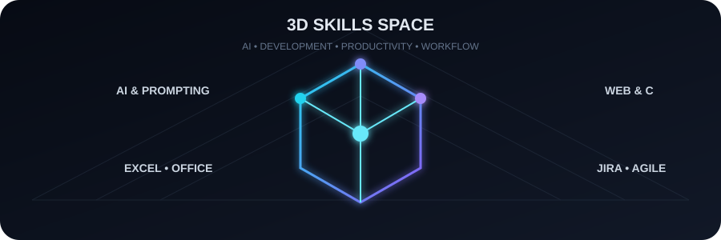
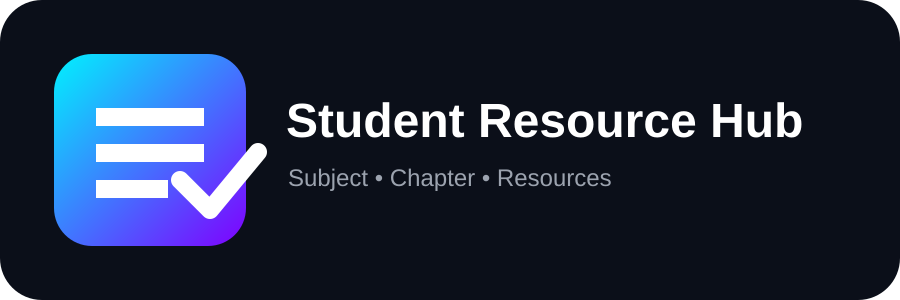
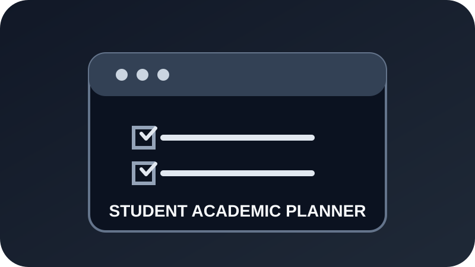

<div align="center">

# Hi, I'm Hanshit Singh 👋

### CSE Student | Builder | Learning through projects


<p>
<a href="https://hanshit.vercel.app/">🌐 Portfolio</a> •
<a href="https://hanshit.vercel.app/jems/">🤖 Jems AI</a> •
<a href="https://github.com/hansitsingh42-rgb/Hanshit">📦 Main Repository</a>
</p>

</div>

---

## 👨‍💻 About Me

I'm a Computer Science student who learns best by making things. I use this repository to keep my projects, experiments, practice work, and the things I want to improve.

Some projects are simple experiments, and some are projects I keep coming back to. I don't expect everything here to be perfect — the point is to learn, build, test, and make the next version better.

> **Learn → Build → Test → Improve → Repeat.**

---

## ⚡ Developer Snapshot

| Focus | Current Direction |
|---|---|
| 🎓 Education | Polytechnic Computer Science |
| 🌐 Building | Web apps & student-focused tools |
| 🎨 Design | UI/UX, information architecture & user flows |
| 💻 Core | C • JavaScript • HTML • CSS |
| 🤖 Exploring | AI tools & prompt engineering |
| 🧰 Workflow | Git • GitHub • Jira • Agile/Scrum |
| 🎯 Goal | Become a stronger practical developer |

---

## 🚀 Currently Working On

Right now, most of my time goes into:

- 🌐 Building practical web projects
- 📚 Improving a personal study-resource library
- 🧩 Making small student-focused tools
- 🎨 Practising UI/UX design and product thinking
- 🔧 Getting more comfortable with Git and GitHub
- 📖 Practising programming and core Computer Science concepts
- 🛠️ Turning ideas into projects that actually work

---

## 🚀 Currently Building

**01 — Student-focused web tools**  
Building simple browser-based tools around problems I come across while studying.

**02 — Student Resource Hub**  
Building a structured academic resource experience around **Subject → Chapter → Resource**, with search, filters, previews and student-focused navigation.

**03 — Jems AI**  
Working on a small assistant that presents documented information about my profile, projects, and repository.

**04 — Developer Foundations**  
Practising C, JavaScript, Git/GitHub, Computer Networks, and other core Computer Science topics.

---

## 🛠️ What I Build

- 🌐 Practical web applications
- 📚 Study & productivity tools
- 🤖 AI-related experiments
- 💻 Beginner-friendly Computer Science projects
- 🧩 Small utilities that help me learn by doing
- 🎨 Interfaces designed with usability and accessibility in mind

---

## 🎨 UI/UX Design & Product Thinking

I am actively developing my UI/UX skills by applying design thinking to real projects rather than treating design as only visual styling.

### Design Practice

- User problem definition
- User and context mapping
- Assumptions vs. validated findings
- Research planning
- Information architecture (IA)
- User flows
- Wireframing and interface structure
- Responsive UI thinking
- Accessibility-first considerations
- Privacy-conscious UX
- Usability testing planning
- Design consistency and reusable patterns

### Current Design Workflow

`Problem → Users → Research Plan → Goals → IA → User Flow → Wireframe → UI → Prototype → Test → Improve`

### Current Case Study

**E-commerce Mobile App — UX Foundation**

A UX case study currently being developed in Figma, covering:

`Problem` → `Users & Context` → `Assumptions` → `Research Plan` → `Goals` → `Information Architecture` → `Core User Flow`

<a href="https://www.figma.com/design/Oc854NFgEm0ovihPL5qfY8">View UX Foundation in Figma</a> • <a href="./docs/ui-ux/ecommerce-mobile-app-case-study.md">Read the Case Study</a>

> This section represents my current design practice and documented work. Research assumptions are kept separate from validated findings.

---

## 🌱 Currently Learning

- C Programming
- JavaScript
- Web Development
- UI/UX Design
- Information Architecture
- User Flows & Wireframing
- Git & GitHub
- Computer Networks

## 💡 Ask Me About

- Computer Science student projects
- Web development basics
- UI/UX fundamentals
- Information architecture and user flows
- Git & GitHub
- Learning resources

## 🤝 Looking to Collaborate On

- Beginner-friendly web projects
- Student projects
- Open-source projects
- Learning-focused experiments
- UI/UX and product-design practice
- Projects where I can learn while contributing

---

## 🛠️ Skills & Tools

<p>


</p>

---

## 🧠 Skills & Technologies

### 💻 Development
`C` `JavaScript` `HTML` `CSS` `Git` `GitHub` `Computer Networks`

### 🎨 UI/UX & Product Design
`Figma` `UI Design` `UX Design` `Information Architecture` `User Flows` `Wireframing` `Prototyping` `Accessibility` `Usability Testing`

### 🤖 AI & Productivity
`AI Tools` `Prompt Engineering` `Microsoft Excel` `Microsoft Word` `Microsoft PowerPoint`

### 📋 Project Workflow
`Jira` `Agile/Scrum` `Project Planning` `Risk Management`

<div align="center">


</div>

---

## 🧊 3D Skills Visualization

<div align="center">

</div>

---

## 🌱 Learning Progress

```text
C Programming           ███████░░░  Building fundamentals
JavaScript              ██████░░░░  Growing web development skills
Git & GitHub            ███████░░░  Improving workflow
Computer Networks       ██████░░░░  Strengthening fundamentals
UI/UX Design            █████░░░░░  Building design foundations
Core CS                 █████░░░░░  Learning step by step
Practical AI            ██████░░░░  Exploring useful applications
```

> Progress matters more than pretending to know everything.

---

## 📊 GitHub Analytics

<div align="center">


</div>

> These analytics cards are self-hosted in the repository, so the profile does not depend on a third-party image endpoint.

---

## 🔥 Contribution Streak

<div align="center">


</div>

---

## 📈 Contribution Graph

<div align="center">


</div>

---

## 🏆 Milestones

- 🎓 Studying Polytechnic Computer Science
- 💻 Building and deploying practical web projects
- 🌐 Maintaining a personal developer portfolio
- 🤖 Built a project-focused AI assistant — Jems AI
- 📚 Building student-focused learning resources
- 🎨 Building documented UI/UX case-study work in Figma
- 🎓 Completed **ADCA — Advanced Diploma in Computer Applications**

---

## 🎨 Project Brand Gallery

<table>
<tr>
<td align="center"></td>
<td align="center"></td>
<td align="center"></td>
</tr>
<tr>
<td align="center">SKH Cast+</td>
<td align="center">Study Resource Manager</td>
<td align="center">Student Productivity Dashboard</td>
</tr>
<tr>
<td align="center"></td>
<td align="center"></td>
<td align="center"></td>
</tr>
<tr>
<td align="center">C Student Record Manager</td>
<td align="center">Jems AI</td>
<td align="center">Student Resource Hub</td>
</tr>
<tr>
<td align="center"></td>
<td align="center"></td>
<td align="center"></td>
</tr>
<tr>
<td align="center">Student Academic Planner</td>
<td align="center"></td>
<td align="center"></td>
</tr>
</table>

---

## 🚀 Selected Work

### 🌦️ SKH Cast+ — Advanced Weather Dashboard


A responsive weather dashboard using Open-Meteo for live weather, location search, hourly data and 7-day forecasts.

**Highlights**  
`Live API` `Geolocation` `City Search` `Hourly Forecast` `7-Day Forecast` `Favorites` `°C/°F` `Dark/Light Mode` `Smart Insights`

**Stack:** `HTML` `CSS` `JavaScript` `Fetch API` `LocalStorage`

<a href="https://hansitsingh42-rgb.github.io/Hanshit/skycast/"></a>

[Source](./projects/advanced-weather-app/)

### 📚 Study Resource Manager


A student-focused resource library for organizing study material, notes, files and useful learning resources.

**Highlights**  
`Resource Library` `Search` `Categories` `Responsive UI` `Student Friendly` `Filters` `Favorites` `Add/Delete` `Dark/Light Mode` `LocalStorage`

**Stack:** `HTML` `CSS` `JavaScript`

<a href="https://hansitsingh42-rgb.github.io/Hanshit/study-resource-manager/"></a>

[Source](./projects/study-resource-manager/)

### 📊 Student Productivity Dashboard


A productivity dashboard for tracking habits, progress and daily performance through simple visual insights.

**Highlights**  
`Habit Tracking` `Charts` `Progress` `Daily Tracking` `Responsive UI` `Tasks` `25-Minute Focus Timer` `Study Tracking` `Progress Stats` `LocalStorage`

**Stack:** `HTML` `CSS` `JavaScript`

<a href="https://hansitsingh42-rgb.github.io/Hanshit/student-productivity-dashboard/"></a>

[Source](./projects/student-productivity-dashboard/)

### 💻 C Student Record Manager


A C-based student record management project for practising structured data handling and core programming fundamentals.

**Highlights**  
`C Programming` `File Handling` `Records` `CRUD Operations` `Structs` `Arrays` `Functions` `Search` `Validation`

**Stack:** `C`

<a href="https://hansitsingh42-rgb.github.io/Hanshit/c-student-record-manager/"></a>

[Source](./projects/c-student-record-manager/)

### 🤖 Jems AI


A small AI-focused assistant project exploring practical AI interactions and a student-oriented experience.

**Highlights**  
`AI Assistant` `Interactive UI` `Student Focused` `Local Storage`

**Focus:** Clear answers from documented profile, project, skill, and repository information rather than invented details.

**Stack:** `HTML` `CSS` `JavaScript`

<a href="https://hansitsingh42-rgb.github.io/Hanshit/jems/"></a>

[Source](./jems/)

### 📘 Student Resource Hub


A student-focused resource discovery interface organized around **Subject → Chapter → Resource**, with search, filters, resource details, previews, bookmarks and responsive navigation.

**Highlights**  
`Subject → Chapter → Resource` `Search` `Filters` `Resource Preview` `Bookmarks` `Progress` `Dark/Light Mode` `Responsive UI` `Keyboard Search`

**Stack:** `HTML` `CSS` `JavaScript` `LocalStorage` `Canvas`

<a href="https://hansitsingh42-rgb.github.io/Hanshit/student-resource-hub/"></a>

[Source](./projects/student-resource-hub/)

> The GitHub Pages version is the static preview/catalog. The separate `student-resource-hub/` application contains the full-stack implementation.

### 📅 Student Academic Planner


A browser-based academic dashboard for organizing subjects, attendance, assignments, study sessions, notes and daily focus time.

**Highlights**  
`Subjects` `Attendance` `Assignments` `Study Sessions` `Notes` `Focus Timer` `Progress Tracking` `Responsive UI` `Dark/Light Mode` `LocalStorage`

**Stack:** `HTML` `CSS` `JavaScript` `LocalStorage`

<a href="https://hansitsingh42-rgb.github.io/Hanshit/student-academic-planner/"></a>

[Source](./projects/student-academic-planner/)

---

## 🧩 Project Branding Standard

I use the following presentation standard across the projects in this repository:

- Dedicated SVG project logo
- Consistent visual language
- README presentation with logo, purpose, highlights, stack, and live/source links
- Accessible assets with descriptive alt text
- Shared **LIVE PREVIEW** button for deployed projects
- All project logos are stored in `assets/project-logos/`
- New projects follow the same branding system

### New Project Template

```text
assets/project-logos/<project-name>.svg
README.md → Brand Gallery + Selected Work + Project Hub
projects/<project-name>/
```

> The goal is to keep the repository easy to explore while still giving each project its own identity.

---

## 🧩 What You'll Find Here

📁 Projects & experiments  •  📝 Learning notes  •  💻 Code practice  •  🚀 Future builds

This repository grows as I learn. I add projects, experiments, notes, and useful resources here as I go.

---

## 🎯 My Goal

My goal is to become a stronger developer by learning projects, understanding user needs, designing usable interfaces, and improving through iteration.

**Learn → Build → Test → Improve → Repeat.**

For me, working on real projects is one of the best ways to understand what I'm learning.

---

## 🤖 Ask Jems AI

<div align="center">

### `JEMS` • `Hanshit Assistant`

**Explore my documented profile, projects, skills and repository.**

<a href="https://hanshit.vercel.app/jems/">

</a>

</div>

Jems uses documented repository information as its source of truth and avoids inventing information that is not documented.

---

## 📱 Portfolio QR

<div align="center">

<a href="https://hanshit.vercel.app/">

</a>

**Scan to open my portfolio.**

</div>

---

## 📁 Project Hub

| Project | Live Preview | Source |
|---|---|---|
| 🌦️ SKH Cast+ Weather Dashboard | [Open](https://hansitsingh42-rgb.github.io/Hanshit/skycast/) | [Source](./projects/advanced-weather-app/) |
| 📚 Study Resource Manager | [Open](https://hansitsingh42-rgb.github.io/Hanshit/study-resource-manager/) | [Source](./projects/study-resource-manager/) |
| 📊 Student Productivity Dashboard | [Open](https://hansitsingh42-rgb.github.io/Hanshit/student-productivity-dashboard/) | [Source](./projects/student-productivity-dashboard/) |
| 💻 C Student Record Manager | [Open](https://hansitsingh42-rgb.github.io/Hanshit/c-student-record-manager/) | [Source](./projects/c-student-record-manager/) |
| 🤖 Jems AI | [Open](https://hansitsingh42-rgb.github.io/Hanshit/jems/) | [Source](./jems/) |
| 📘 Student Resource Hub | [Open](https://hansitsingh42-rgb.github.io/Hanshit/student-resource-hub/) | [Source](./projects/student-resource-hub/) |
| 📅 Student Academic Planner | [Open](https://hansitsingh42-rgb.github.io/Hanshit/student-academic-planner/) | [Source](./projects/student-academic-planner/) |

---

## 📊 GitHub Activity

<div align="center">


</div>

---

## ⚡ Fun Fact

A lot of my learning starts with a simple question: can I turn this into something that actually works?

---

<div align="center">

### Thanks for visiting! ⭐

**Built with curiosity, consistency, and a lot of learning.**


</div>

⭐ If you find something useful here, feel free to explore the repository.
