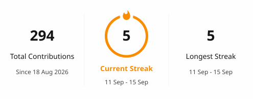

<div align="center">

# Hi, I'm Hanshit Singh 👋

### `CSE Student` • `Builder` • `Tech Explorer`


<p>
<a href="https://hanshit.vercel.app/">🌐 Portfolio</a> •
<a href="https://hanshit.vercel.app/jems/">🤖 Jems AI</a> •
<a href="https://github.com/hansitsingh42-rgb/Hanshit">📦 Main Repository</a>
</p>

</div>

---

## 👨‍💻 About Me

I'm a Computer Science student focused on learning through practical projects. I use this GitHub to experiment, build useful ideas, document my learning, and improve step by step.

I'm a Computer Science student focused on building practical projects and improving my development skills step by step. I use this space to document what I learn, experiment with ideas, and build useful projects.

> **Learn → Build → Test → Improve → Repeat.**

---

## ⚡ Developer Snapshot

| Focus | Current Direction |
|---|---|
| 🎓 Education | Polytechnic Computer Science |
| 🌐 Building | Web apps & student-focused tools |
| 💻 Core | C • JavaScript • HTML • CSS |
| 🤖 Exploring | AI tools & prompt engineering |
| 🧰 Workflow | Git • GitHub • Jira • Agile/Scrum |
| 🎯 Goal | Become a stronger practical developer |

---

## 🚀 Currently Working On

- 🌐 Practical web projects
- 📚 A personal study-resource library
- 🧩 Student-focused digital projects
- 🔧 Improving my Git & GitHub workflow
- Building practical web projects
- Developing a personal study-resource library
- Improving my programming and GitHub workflow

---

## 🚀 Currently Building

**01 — Student-focused web tools**  
Building practical browser-based tools that solve simple student problems.

**02 — Personal Study Resource Library**  
Organizing useful learning resources into a simple, searchable experience.

**03 — Jems AI**  
Improving a visitor-facing assistant that answers from documented profile, project, and repository information.

**04 — Developer Foundations**  
Strengthening C, JavaScript, Git/GitHub, Computer Networks, and core Computer Science concepts.

---

## 🛠️ What I Build

- 🌐 Practical web applications
- 📚 Study & productivity tools
- 🤖 AI-powered experiments
- 💻 Beginner-friendly Computer Science projects
- 🧩 Small utilities that turn ideas into working products

---

## 🌱 Currently Learning

- C Programming
- JavaScript
- Web Development
- Git & GitHub
- Computer Networks

## 💡 Ask Me About

- Computer Science student projects
- Web development basics
- Git & GitHub
- Learning resources

## 🤝 Looking to Collaborate On

- Beginner-friendly web projects
- Student projects
- Open-source projects
- Learning-focused experiments
- Student-focused projects
- Open-source projects where I can learn and contribute

---

## 🛠️ Skills & Tools

<p>


</p>

---

## 🧠 Skills & Technologies

### 💻 Development
`C` `JavaScript` `HTML` `CSS` `Git` `GitHub` `Computer Networks`

### 🤖 AI & Productivity
`AI Tools` `Prompt Engineering` `Microsoft Excel` `Microsoft Word` `Microsoft PowerPoint`

### 📋 Project Workflow
`Jira` `Agile/Scrum` `Project Planning` `Risk Management`

<div align="center">


</div>

---

## 🧊 3D Skills Visualization

<div align="center">

</div>

---

## 🌱 Learning Progress

```text
C Programming          ███████░░░  Building fundamentals
JavaScript             ██████░░░░  Growing web development skills
Git & GitHub            ███████░░░  Improving workflow
Computer Networks       ██████░░░░  Strengthening fundamentals
Core CS                 █████░░░░░  Learning step by step
Practical AI            ██████░░░░  Exploring useful applications
```

> Progress matters more than pretending to know everything.

---

## 📊 GitHub Analytics

<div align="center">




</div>

> These analytics cards are self-hosted in the repository, so the profile does not depend on a third-party image endpoint.

---

## 🔥 Contribution Streak

<div align="center">



</div>

---

## 📈 Contribution Graph

<div align="center">



</div>

---

## 🏆 Milestones

- 🎓 Studying Polytechnic Computer Science
- 💻 Building and deploying practical web projects
- 🌐 Maintaining a personal developer portfolio
- 🤖 Built a project-focused AI assistant — Jems AI
- 📚 Building student-focused learning resources
- 🎓 Completed **ADCA — Advanced Diploma in Computer Applications**

---

## 🎨 Project Brand Gallery

<table>
<tr>
<td align="center"></td>
<td align="center"></td>
<td align="center"></td>
</tr>
<tr>
<td align="center">SKH Cast+</td>
<td align="center">Study Resource Manager</td>
<td align="center">Student Productivity Dashboard</td>
</tr>
<tr>
<td align="center"></td>
<td align="center"></td>
<td align="center"></td>
</tr>
<tr>
<td align="center">C Student Record Manager</td>
<td align="center">Jems AI</td>
<td align="center"></td>
</tr>
</table>

---

## 🚀 Selected Work

### 🌦️ SKH Cast+ — Advanced Weather Dashboard


A responsive API-integrated weather dashboard using Open-Meteo for live weather, location search, hourly data and 7-day forecasts.

**Highlights**  
`Live API` `Geolocation` `City Search` `Hourly Forecast` `7-Day Forecast` `Favorites` `°C/°F` `Dark/Light Mode` `Smart Insights`

**Stack:** `HTML` `CSS` `JavaScript` `Fetch API` `LocalStorage`

<a href="https://hansitsingh42-rgb.github.io/Hanshit/skycast/"></a>

[Source](./projects/advanced-weather-app/)

### 📚 Study Resource Manager


A student-focused resource library for organizing study material, notes, files and useful learning resources.

**Highlights**  
`Resource Library` `Search` `Categories` `Responsive UI` `Student Friendly` `Search` `Filters` `Favorites` `Add/Delete` `Dark/Light Mode` `LocalStorage`

**Stack:** `HTML` `CSS` `JavaScript`

<a href="https://hansitsingh42-rgb.github.io/Hanshit/study-resource-manager/"></a>

[Source](./projects/study-resource-manager/)

### 📊 Student Productivity Dashboard


A productivity dashboard designed for students to track habits, progress and daily performance through clear visual insights.

**Highlights**  
`Habit Tracking` `Charts` `Progress` `Daily Tracking` `Responsive UI` `Tasks` `25-Minute Focus Timer` `Study Tracking` `Progress Stats` `LocalStorage`

**Stack:** `HTML` `CSS` `JavaScript`

<a href="https://hansitsingh42-rgb.github.io/Hanshit/student-productivity-dashboard/"></a>

[Source](./projects/student-productivity-dashboard/)

### 💻 C Student Record Manager


A C-based student record management project focused on structured data handling and core programming fundamentals.

**Highlights**  
`C Programming` `File Handling` `Records` `CRUD Operations` `Structs` `Arrays` `Functions` `Search` `Validation`

**Stack:** `C`

<a href="https://hansitsingh42-rgb.github.io/Hanshit/c-student-record-manager/"></a>

[Source](./projects/c-student-record-manager/)

### 🤖 Jems AI


An AI-focused personal assistant project exploring practical AI interactions and a student-oriented experience.

**Highlights**  
`AI Assistant` `Interactive UI` `Student Focused` `Local Storage`

**Focus:** Clear answers from documented profile, project, skill, and repository information rather than invented details.

**Stack:** `HTML` `CSS` `JavaScript`

<a href="https://hansitsingh42-rgb.github.io/Hanshit/jems/"></a>

[Source](./Jems/)

---

## 🧩 Project Branding Standard

Every project in this repository follows the same professional presentation standard:

- Dedicated SVG project logo
- Consistent visual language
- README presentation with logo, purpose, highlights, stack, and live/source links
- Accessible assets with descriptive alt text
- Shared animated **LIVE PREVIEW** button for deployed projects
- All project logos are stored in `assets/project-logos/`
- New projects must follow the same branding system

### New Project Template

```text
assets/project-logos/<project-name>.svg
README.md → Brand Gallery + Selected Work + Project Hub
projects/<project-name>/
```

> One repository. One visual system. Every project gets its own identity.

---

## 🧩 What You'll Find Here

📁 Projects & experiments  •  📝 Learning notes  •  💻 Code practice  •  🚀 Future builds

This repository is part of my learning journey. I'll be adding projects, experiments, notes, and useful resources as I continue developing my skills.

---

## 🎯 My Goal

To become a stronger developer by consistently learning, building real projects, and improving my problem-solving skills.

**Learn → Build → Improve → Repeat.**

I believe consistent practice and real projects are the best way to grow as a developer.

---

## 🤖 Ask Jems AI

<div align="center">

### `JEMS` • `Hanshit Assistant`

**Explore my documented profile, projects, skills and repository.**

<a href="https://hanshit.vercel.app/jems/">

</a>

</div>

Jems uses documented repository information as its source of truth and avoids inventing information that is not documented.

---

## 📱 Portfolio QR

<div align="center">

<a href="https://hanshit.vercel.app/">

</a>

**Scan to open my portfolio.**

</div>

---

## 📁 Project Hub

| Project | Live Preview | Source |
|---|---|---|
| 🌦️ SKH Cast+ Weather Dashboard | [Open](https://hansitsingh42-rgb.github.io/Hanshit/skycast/) | [Source](./projects/advanced-weather-app/) |
| 📚 Study Resource Manager | [Open](https://hansitsingh42-rgb.github.io/Hanshit/study-resource-manager/) | [Source](./projects/study-resource-manager/) |
| 📊 Student Productivity Dashboard | [Open](https://hansitsingh42-rgb.github.io/Hanshit/student-productivity-dashboard/) | [Source](./projects/student-productivity-dashboard/) |
| 💻 C Student Record Manager | [Open](https://hansitsingh42-rgb.github.io/Hanshit/c-student-record-manager/) | [Source](./projects/c-student-record-manager/) |
| 🤖 Jems AI | [Open](https://hansitsingh42-rgb.github.io/Hanshit/jems/) | [Source](./Jems/) |

---

## 📊 GitHub Activity

<div align="center">


</div>

---

## ⚡ Fun Fact

I enjoy turning things I learn into practical projects.

I'm a CSE student who enjoys turning what I learn into practical projects.

---

<div align="center">

### Thanks for visiting! ⭐

**Built with curiosity, consistency, and a lot of learning.**


</div>

⭐ If you find something useful here, feel free to explore the repository.
