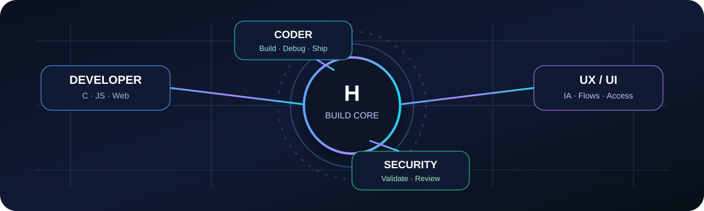

# Hi, I'm Hanshit Singh

### CSE Student | Developer | Learning by Building

<strong>Developer Component System</strong> — optional visual/structure reference

<table>
<tr>
<td align="center" width="25%">

### ◉ Identity
**Hanshit Developer**

CSE Student

</td>
<td align="center" width="25%">

### ◈ Build
**Building Projects**

Ideas → Code

</td>
<td align="center" width="25%">

### ◇ Learn
**Learning by Building**

Test → Improve

</td>
<td align="center" width="25%">

### ◎ Secure
**Security First**

Validate → Review

</td>
</tr>
</table>

#### 01 — Build Pipeline

`Understand` → `Plan` → `Design` → `Build` → `Test` → `Secure` → `Document` → `Improve`

#### 02 — Skill Matrix

| Core Development | Product & UX | Workflow | AI & Productivity |
|---|---|---|---|
| `C` `JavaScript` | `Figma` `UI/UX` | `Git` `GitHub` | `AI Tools` |
| `HTML` `CSS` | `IA` `User Flows` | `Jira` `Agile/Scrum` | `Prompt Engineering` |
| `Computer Networks` | `Wireframing` `Accessibility` | `Testing` `CI` | `Excel` `PowerPoint` |

#### 03 — Project Component Cards

<table>
<tr>
<td><strong>🌦️ SKH Cast+</strong> Live weather · API · Geolocation</td>
<td><strong>📚 Study Resource Manager</strong> Search · Filters · Favorites</td>
<td><strong>📊 Productivity Dashboard</strong> Tasks · Timer · Progress</td>
</tr>
<tr>
<td><strong>💻 C Student Record Manager</strong> C · CRUD · File Handling</td>
<td><strong>🤖 Jems AI</strong> Assistant · Documented Data</td>
<td><strong>📘 Student Resource Hub</strong> Subject → Chapter → Resource</td>
</tr>
</table>

#### 04 — 3D / Visual Layer

#### 05 — Evidence Layer

`Live Preview` · `Source` · `Security` · `UX Case Study` · `Documentation`

**Engineering Quality** — [Security Policy](./SECURITY.md) · [Engineering Baseline](./docs/ENGINEERING.md) · CodeQL · CI quality checks · [Repository Architecture](./docs/REPOSITORY_ARCHITECTURE.md) · Dependency Review

> Existing project details remain below. This component layer is an additional presentation system, not a replacement.

[Portfolio](https://hansitsingh42-rgb.github.io/Hanshit/) · [Jems AI](https://hansitsingh42-rgb.github.io/Hanshit/jems/) · [Repository](https://github.com/hansitsingh42-rgb/Hanshit)

> **Start here:** Featured Builds → Engineering → Security & Quality → Selected Work → GitHub evidence.

---

## ⚙️ Engineering at a Glance

> Learn deeply → build practically → verify honestly → improve continuously

| Layer | What this repository demonstrates |
|---|---|
| **Engineering** | C, JavaScript, HTML/CSS, browser APIs, data handling and practical web applications |
| **Projects** | Student tools, productivity systems, weather intelligence, AI experiments and academic resources |
| **Quality** | Input validation, error handling, accessibility, secure defaults, CI checks and CodeQL |
| **Workflow** | Git, GitHub, focused commits, documentation, review checklists and reproducible verification |
| **Product thinking** | Clear user problems, information architecture, responsive UI and usability considerations |

### Featured Build Evidence

- **SKH Cast+** — API integration, geolocation, async requests, cancellation, local storage and responsive weather UI
- **Study Resource Manager** — filtering, favorites, persistence, URL validation and safe DOM rendering
- **Student Productivity Dashboard** — task state, persistent study time, timer logic and accessible controls
- **C Student Record Manager** — C CRUD workflow, bounded input handling and validation
- **Student Resource Hub** — structured academic resources with a clear Subject → Chapter → Resource model

> **Principle:** existing projects are learning evidence. I document limitations instead of presenting unfinished work as production-ready.

---

## 👨‍💻 About Me

> Learn by building · Practical development · Continuous improvement

I'm a Computer Science student who learns best by making things. I use this repository to keep my projects, experiments, practice work, and the things I want to improve.

Some projects are simple experiments, and some are projects I keep coming back to. I don't expect everything here to be perfect — the point is to learn, build, test, and make the next version better.

> **Learn → Build → Test → Improve → Repeat.**

---

## 🧭 Current Build

> Current build → architecture → UX → validation → security

**Student Resource Hub** is the main full-stack learning project I am improving around a simple **Subject → Chapter → Resource** structure. Current work includes resource discovery, responsive navigation, authentication, validation, testing, and security hardening.

### What I am improving

- Better project structure and maintainability
- Responsive and accessible interfaces
- Validation, error handling, and secure defaults
- CI checks, dependency auditing, and CodeQL coverage
- Clear documentation and project evidence

---

## 🧩 How I Build

> Understand → Plan → Design → Build → Test → Secure → Document → Improve

`Understand → Plan → Design → Build → Test → Secure → Document → Improve`

I use this workflow to turn learning topics into practical projects. The goal is not to present every project as production software; project status and limitations are documented where they matter.

---

## 🔐 Security-First Development

> Protect secrets → Validate input → Audit dependencies → Scan code → Least privilege

Security is part of the build process, not an afterthought.

- Keep credentials and secrets out of source control
- Use environment variables and CI secrets for sensitive configuration
- Validate untrusted input and handle errors safely
- Apply secure HTTP headers where the application supports them
- Review dependencies with automated auditing and Dependabot
- Use CodeQL and CI checks to catch issues early
- Document project-specific security considerations
- Prefer least-privilege GitHub Actions permissions

Repository-level security guidance is documented in [SECURITY.md](./SECURITY.md).

---

## 🧪 Testing & Quality Evidence

> Lint → Build → Audit → Security → Browser/UX → Documentation

For projects where it applies, I document more than the final UI:

`Lint → Build → Dependency Audit → Security Checks → Browser/UX Checks → Documentation`

This makes the repository easier to inspect and helps separate **what is built**, **what is tested**, and **what is still being improved**.

---

## 🎨 UI/UX Design & Product Thinking

> Problem → Research → IA → Flow → Wireframe → UI → Prototype → Test → Improve

I am actively developing my UI/UX skills by applying design thinking to real projects rather than treating design as only visual styling.

### Design Practice

- User problem definition
- User and context mapping
- Assumptions vs. validated findings
- Research planning
- Information architecture (IA)
- User flows
- Wireframing and interface structure
- Responsive UI thinking
- Accessibility-first considerations
- Privacy-conscious UX
- Usability testing planning
- Design consistency and reusable patterns

### Current Design Workflow

`Problem → Users → Research Plan → Goals → IA → User Flow → Wireframe → UI → Prototype → Test → Improve`

### Current Case Study

**E-commerce Mobile App — UX Foundation**

A UX case study currently being developed in Figma, covering:

`Problem` → `Users & Context` → `Assumptions` → `Research Plan` → `Goals` → `Information Architecture` → `Core User Flow`

<a href="https://www.figma.com/design/Oc854NFgEm0ovihPL5qfY8">View UX Foundation in Figma</a> • <a href="./docs/ui-ux/ecommerce-mobile-app-case-study.md">Read the Case Study</a>

> This section represents my current design practice and documented work. Research assumptions are kept separate from validated findings.

---

## 🌱 Currently Learning

- C Programming
- JavaScript
- Web Development
- UI/UX Design
- Information Architecture
- User Flows & Wireframing
- Git & GitHub
- Computer Networks

## 🧠 Skills & Technologies

Full skill matrix

> Code + UX + AI + workflow, organized as reusable capability groups

### 💻 Development
`C` `JavaScript` `HTML` `CSS` `Git` `GitHub` `Computer Networks`

### 🎨 UI/UX & Product Design
`Figma` `UI Design` `UX Design` `Information Architecture` `User Flows` `Wireframing` `Prototyping` `Accessibility` `Usability Testing`

### 🤖 AI & Productivity
`AI Tools` `Prompt Engineering` `Microsoft Excel` `Microsoft Word` `Microsoft PowerPoint`

### 📋 Project Workflow
`Jira` `Agile/Scrum` `Project Planning` `Risk Management`

---

## 🧊 3D Skills Visualization

> **3D VISUAL COMPONENT** · Spatial skill map for the existing capability data

---

## 📊 GitHub Analytics

> Repository activity and language signals

> These analytics cards are self-hosted in the repository, so the profile does not depend on a third-party image endpoint.

---

## 🏆 Milestones

- 🎓 Studying Polytechnic Computer Science
- 💻 Building and deploying practical web projects
- 🌐 Maintaining a personal developer portfolio
- 🤖 Built a project-focused AI assistant — Jems AI
- 📚 Building student-focused learning resources
- 🎨 Building documented UI/UX case-study work in Figma
- 🎓 Completed **ADCA — Advanced Diploma in Computer Applications**

---

## 🚀 Selected Work

> **Canonical project index:** purpose → engineering → stack → evidence → learning.

> Selected projects are presented as engineering evidence: **problem → implementation → engineering decisions → verification → demo/source**.

### 🌦️ SKH Cast+ — Advanced Weather Dashboard

**Developer · Deployed learning project**

A responsive weather dashboard built around live weather data, location search, geolocation, hourly forecasts and 7-day forecasts.

**Engineering**
- Open-Meteo API integration with asynchronous request handling
- Geolocation and city-search flows
- Abortable requests and client-side preference persistence
- Responsive UI with unit/theme preferences and defensive storage handling

**Stack:** `HTML` `CSS` `JavaScript` `Fetch API` `LocalStorage`

**Evidence:** [Live Demo](https://hansitsingh42-rgb.github.io/Hanshit/skycast/) · [Source](./projects/advanced-weather-app/) · [Project README](./projects/advanced-weather-app/README.md)

**Learning:** Working with external APIs, async state, geolocation, cancellation and resilient browser-side storage.

### 📚 Study Resource Manager

**Developer · Deployed learning project**

A student resource library for organizing study material with search, filtering, categories and favorites.

**Engineering**
- Safe DOM rendering and validated resource input
- URL validation before external navigation
- LocalStorage persistence with failure handling
- Stable resource interactions and responsive states

**Stack:** `HTML` `CSS` `JavaScript`

**Evidence:** [Live Demo](https://hansitsingh42-rgb.github.io/Hanshit/study-resource-manager/) · [Source](./projects/study-resource-manager/) · [Project README](./projects/study-resource-manager/README.md)

**Learning:** Designing a practical browser data workflow while keeping input and navigation boundaries explicit.

### 📊 Student Productivity Dashboard

**Developer · Deployed learning project**

A browser-based productivity dashboard for tasks, focus sessions, progress tracking and daily study activity.

**Engineering**
- Persistent client-side state with defensive LocalStorage handling
- Input length validation before persistence
- Stable accessibility IDs for task controls
- Clear state-driven UI interactions

**Stack:** `HTML` `CSS` `JavaScript`

**Evidence:** [Live Demo](https://hansitsingh42-rgb.github.io/Hanshit/student-productivity-dashboard/) · [Source](./projects/student-productivity-dashboard/) · [Project README](./projects/student-productivity-dashboard/README.md)

**Learning:** Turning stateful productivity requirements into predictable browser interactions.

### 💻 C Student Record Manager

**C Programmer / Developer · Learning project**

A C-based record-management project focused on structured data, CRUD operations and defensive input handling.

**Engineering**
- Structs and bounded arrays for record management
- Input validation and controlled string handling
- Search and CRUD workflows
- File-handling practice with explicit data boundaries

**Stack:** `C`

**Evidence:** [Live Demo](https://hansitsingh42-rgb.github.io/Hanshit/c-student-record-manager/) · [Source](./projects/c-student-record-manager/) · [Project README](./projects/c-student-record-manager/README.md)

**Learning:** Building reliable fundamentals around data structures, functions, validation and file handling in C.

### 🤖 Jems AI

**Developer · Experimental project**

A small AI-focused assistant exploring grounded interaction with documented profile, project and repository information.

**Engineering**
- Documented data as the intended source of truth
- Clear separation between known information and unsupported claims
- Student-focused interaction flow

**Stack:** `HTML` `CSS` `JavaScript`

**Evidence:** [Live Demo](https://hansitsingh42-rgb.github.io/Hanshit/jems/) · [Source](./jems/)

**Learning:** Designing assistant experiences around grounded information instead of presenting unsupported output as fact.

### 📘 Student Resource Hub

**Developer / UI implementer · Active build**

A resource-discovery system organized around **Subject → Chapter → Resource**, with search, filters, previews, bookmarks and responsive navigation.

**Engineering**
- Clear information architecture for academic resources
- Responsive discovery and navigation flows
- Static GitHub Pages preview separated from the full-stack application
- Validation, authentication and security work documented at the application level

**Stack:** `HTML` `CSS` `JavaScript` `LocalStorage` `Canvas`

**Evidence:** [Static Demo](https://hansitsingh42-rgb.github.io/Hanshit/student-resource-hub/) · [Static Source](./projects/student-resource-hub/) · [Full-stack App](./student-resource-hub/)

### 📅 Student Study Planner — UX Prototype

**UI/UX practitioner / Developer · UX prototype**

A study-planning prototype focused on weekly planning, visible next actions and distraction-free focus sessions.

**Engineering & UX**
- Problem → research plan → IA → user flow → wireframe → UI → prototype → test → improve
- Responsive interaction states
- Accessibility and privacy-conscious UX considerations

**Stack:** `HTML` `CSS` `JavaScript`

**Evidence:** [Live Demo](https://hansitsingh42-rgb.github.io/Hanshit/student-study-planner/) · [Source](./projects/student-study-planner/) · [UX Case Study](./docs/ui-ux/student-study-planner-case-study.md) · [Security](./projects/student-study-planner/SECURITY.md)

### 📅 Student Academic Planner

**Developer · Deployed learning project**

A browser-based academic dashboard for subjects, attendance, assignments, study sessions, notes and focus time.

**Engineering**
- Multiple student workflows represented as clear browser states
- Local persistence with responsive UI
- Attendance, assignment and study-session interactions

**Stack:** `HTML` `CSS` `JavaScript` `LocalStorage`

**Evidence:** [Live Demo](https://hansitsingh42-rgb.github.io/Hanshit/student-academic-planner/) · [Source](./projects/student-academic-planner/)

> **Selection principle:** projects remain visible because they document the learning path. Claims are kept proportional to what is actually implemented and verified.
---

## 🤖 Ask Jems AI

> Documented data → grounded interaction → clear source of truth

### `JEMS` • `Hanshit Assistant`

**Explore my documented profile, projects, skills and repository.**

Jems uses documented repository information as its source of truth and avoids inventing information that is not documented.

---

---

### Quick Links

[Portfolio](https://hansitsingh42-rgb.github.io/Hanshit/) · [Jems AI](https://hansitsingh42-rgb.github.io/Hanshit/jems/) · [Repository](https://github.com/hansitsingh42-rgb/Hanshit) · [Security](./SECURITY.md) · [Engineering](./docs/ENGINEERING.md)
