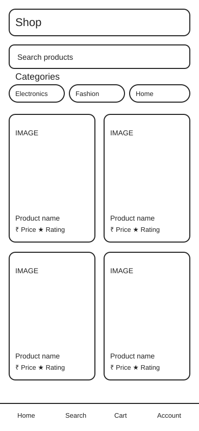
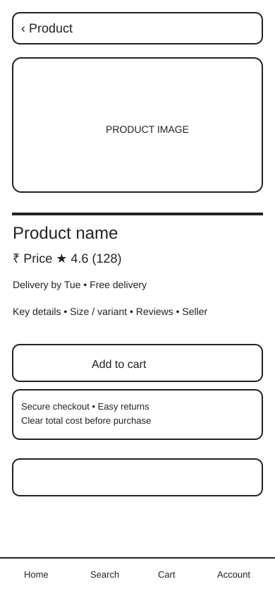
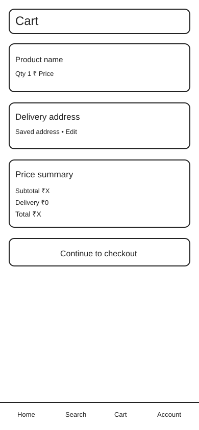

# E-commerce Mobile App — UX Case Study

## Status

**In progress — UX foundation + initial wireframes**

This case study documents a product-design exercise focused on reducing uncertainty during mobile shopping.

## Problem Space

Mobile shoppers may need to compare product information, delivery expectations, price, ratings, and checkout details before deciding to purchase.

The current problem statement is a **working hypothesis**, not a validated research finding.

## UX Process

`Problem → Users → Research Plan → Goals → IA → User Flow → Wireframe → UI → Prototype → Test → Improve`

## Users & Context

**Primary user:** Mobile shopper comparing products before purchase.

**Context:**
- Short, task-focused sessions
- Repeated comparison of price, delivery, ratings, and product details
- Potentially varying network quality

**Research questions:**
- What creates trust during product comparison?
- Where do users hesitate or abandon?
- Which information is essential before checkout?

## Research Plan

Planned validation activities:
- 5–7 moderated usability interviews
- Competitive / heuristic review of 3–5 mobile shopping flows
- Short task-based prototype test

Research assumptions will remain separate from validated findings.

## Product Goals

1. Help users understand products quickly.
2. Make delivery and total cost predictable.
3. Reduce avoidable friction before purchase.
4. Keep interactions accessible and privacy-conscious.

## Information Architecture

```text
Home
├── Search
├── Categories
├── Product listing
│   ├── Filters
│   └── Sort
├── Product detail
│   ├── Images
│   ├── Price & offers
│   ├── Delivery
│   ├── Ratings & reviews
│   └── Add to cart
├── Cart
│   └── Price summary
└── Checkout
    ├── Address
    ├── Delivery option
    ├── Payment
    └── Confirmation
```

## Core User Flow

`Discover → Search / Category → Product List → Product Detail → Add to Cart → Cart Review → Checkout → Confirmation`

### UX guardrails

- Clear back navigation
- Persistent cart access
- Inline validation
- No surprise fees
- Accessible labels and touch targets
- Minimise collection of unnecessary personal data

## Wireframes

The case study now has three documented wireframe directions:

- **WF-01 — Discover & Search**
- **WF-02 — Product Detail**
- **WF-03 — Cart & Checkout**

### Repository previews







## Mobile UI Direction

The next design phase will convert the validated wireframe structure into polished mobile UI screens while keeping the hierarchy and interaction model traceable to the UX work.

Planned screens:
1. Discover & Search
2. Product Detail
3. Cart & Checkout

## Component / Design System Direction

The UI will use a small reusable foundation rather than one-off screens:

- Color tokens
- Typography scale
- Spacing scale
- Corner radius
- Buttons
- Search field
- Product card
- Navigation
- Price / delivery information
- Feedback and validation states

## Component Foundation

The reusable UI foundation is documented separately in [Mobile UI Component Foundation](./mobile-ui-component-foundation.md), including typography, spacing, touch-target, component-state, accessibility, and privacy rules.

## Accessibility & Privacy

Accessibility considerations include readable hierarchy, sufficient touch targets, clear labels, predictable navigation, and visible feedback.

Privacy-conscious UX means avoiding unnecessary personal-data collection and making important decisions transparent to the user.

## Figma

[Open the UX Foundation in Figma](https://www.figma.com/design/Oc854NFgEm0ovihPL5qfY8)

## Evidence Status

This case study is an **active learning project**. Research claims are not presented as validated findings until testing is completed.
